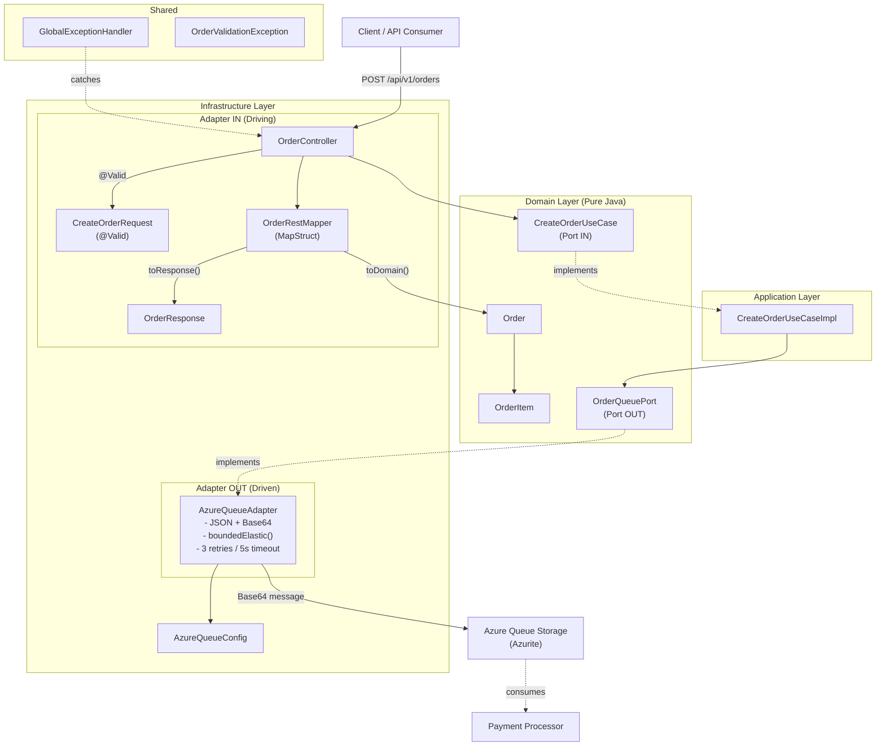
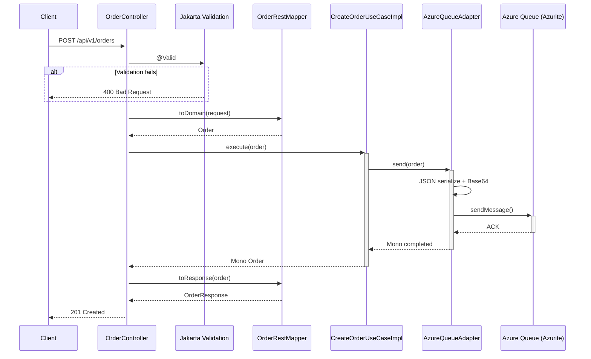

# Order Service

Reactive microservice that receives purchase orders via REST and publishes them to an Azure Queue Storage for asynchronous processing. Part of a distributed system alongside Payment Processor.

## Tech Stack

| Technology | Version | Purpose |
|---|---|---|
| Java | 17 | Core language |
| Spring Boot | 3.4.4 | Main framework |
| Spring WebFlux | - | Reactive endpoints (Mono/Flux) |
| Azure Storage Queue SDK | 12.25.0 | Queue message publishing |
| MapStruct | 1.6.3 | DTO <-> Domain mapping |
| Lombok | - | Boilerplate reduction |
| Jakarta Validation | - | DTO validation |
| SpringDoc OpenAPI | 2.8.6 | Swagger UI documentation |
| Jackson | - | JSON serialization |
| Azurite | latest | Local Azure Storage emulator |
| Maven | - | Build and dependency management |

## Architecture (Hexagonal / Ports & Adapters)

```
com.tcs.orderservice
├── order/
│   ├── domain/              # Pure models and ports
│   │   ├── model/           # Order, OrderItem (no framework dependencies)
│   │   └── port/            # Interfaces: CreateOrderUseCase (in), OrderQueuePort (out)
│   ├── application/         # Use case implementations
│   └── infrastructure/
│       ├── adapter/in/      # REST Controller, DTOs, MapStruct Mapper
│       └── adapter/out/     # AzureQueueAdapter (publishes to queue)
└── shared/exception/        # Domain exceptions + GlobalExceptionHandler
```

### Architecture Diagram



### Request Flow



## Prerequisites

- **Java 17**
- **Docker** (to run the infrastructure containers)

## Infrastructure Setup

The project requires Azurite (Azure Storage emulator) running on `localhost:10001`. Use the following `docker-compose.yaml`:

```yaml
services:
  azurite:
    container_name: azurite-emulator
    image: mcr.microsoft.com/azure-storage/azurite
    command: azurite -l /data --blobHost 0.0.0.0 --queueHost 0.0.0.0 --tableHost 0.0.0.0
    ports:
      - "10000:10000"
      - "10001:10001"
      - "10002:10002"
    volumes:
      - azurite-data:/data

volumes:
  azurite-data:
```

```bash
docker compose up -d
```

## Build & Run

```bash
# Full build
./mvnw clean install

# Run the application
./mvnw spring-boot:run

# Run tests
./mvnw test
```

The application starts on port **8080**.

## API

### Create Order

- **Endpoint:** `POST /api/v1/orders`
- **Content-Type:** `application/json`

**cURL:**

```bash
curl --location 'http://localhost:8080/api/v1/orders' \
--header 'Content-Type: application/json' \
--data '{
  "orderId": "ORD-1001",
  "customerId": "CUS-2001",
  "items": [
    {
      "productId": "PROD-001",
      "quantity": 2
    },
    {
      "productId": "PROD-002",
      "quantity": 1
    }
  ],
  "totalAmount": 150.00
}'
```

**Successful Response (201):**

```json
{
  "status": 201,
  "message": "Order processed successfully",
  "order": {
    "orderId": "ORD-1001",
    "customerId": "CUS-2001",
    "items": [
      { "productId": "PROD-001", "quantity": 2 },
      { "productId": "PROD-002", "quantity": 1 }
    ],
    "totalAmount": 150.00,
    "createdAt": "2026-03-11T15:30:00"
  }
}
```

### Swagger UI

Available at: `http://localhost:8080/webjars/swagger-ui/index.html`

## Configuration

The `application.yaml` file defines the Azurite connection:

```yaml
azure:
  storage:
    connection-string: DefaultEndpointsProtocol=http;AccountName=devstoreaccount1;AccountKey=Eby8vdM02xNOcqFlqUwJPLlmEtlCDXJ1OUzFT50uSRZ6IFsuFq2UVErCz4I6tq/K1SZFPTOtr/KBHBeksoGMGw==;QueueEndpoint=http://127.0.0.1:10001/devstoreaccount1
    queue-name: orders-queue
```

Can be overridden with environment variables: `AZURE_STORAGE_CONNECTION_STRING` and `AZURE_STORAGE_QUEUE_NAME`.
